One of the highlights of my recent UK trip was a special meet-and-greet and tour of Anfield Stadium. If you're a soccer fan (or football, as it's called in the UK), you might be familiar with Anfield. It's the home of Liverpool Football Club, currently second in the Premier League and overall just a fantastic club.

The event kicked off with a 45-minute meet-and-greet with an LFC "Legend." We were fortunate to speak with Jan Mølby, a midfielder who played for the team for 16 years. He shared insights about changes in the league and the game since his time, offering fascinating historical tidbits about the sport and team.

Following the meet-and-greet, we embarked on a guided tour of the stadium, delving deeper into the team's history. LFC's slogan, "You'll Never Walk Alone," has evolved significantly since becoming their signature in 1963. After a tragic incident in 1989 where 96 fans lost their lives in a human crush, the phrase became central to the team and community. It now serves as a poignant reminder that no one is alone, and that football is more than just a sport—it's a family.

<!-- TODO: Consider other image treatments -->

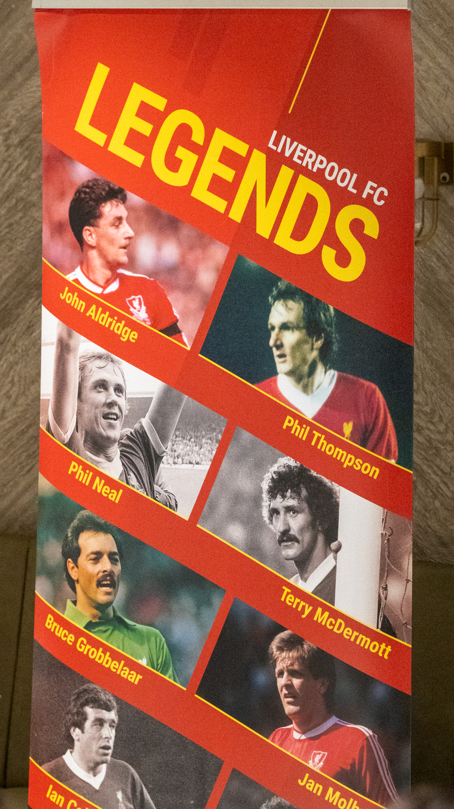

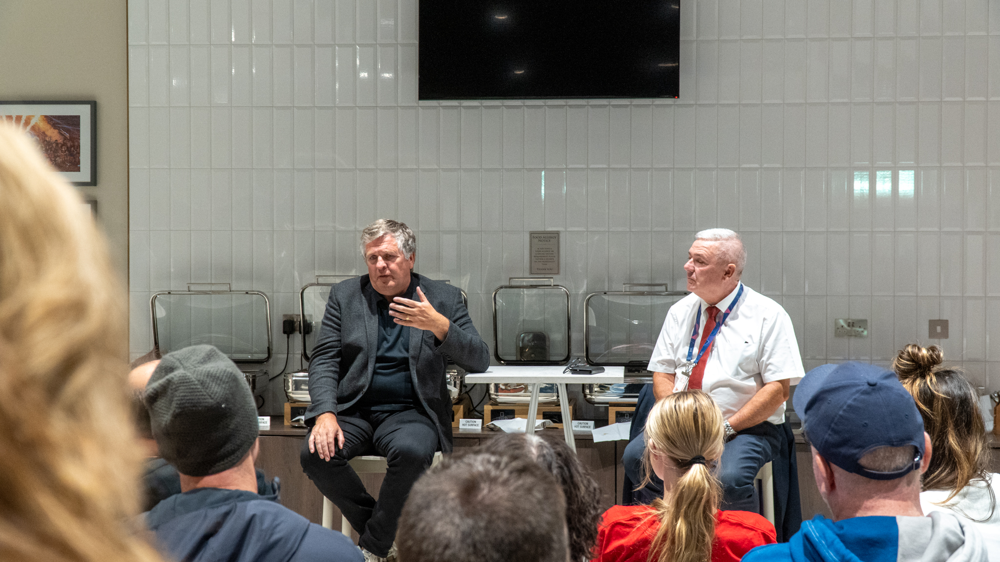

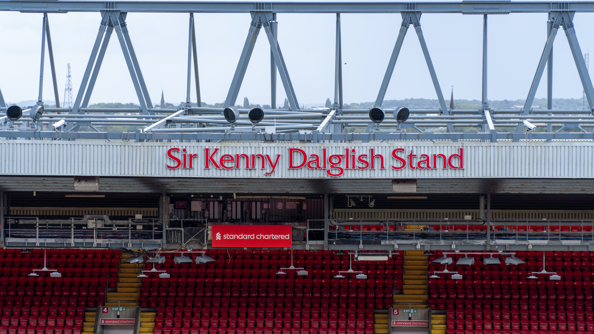

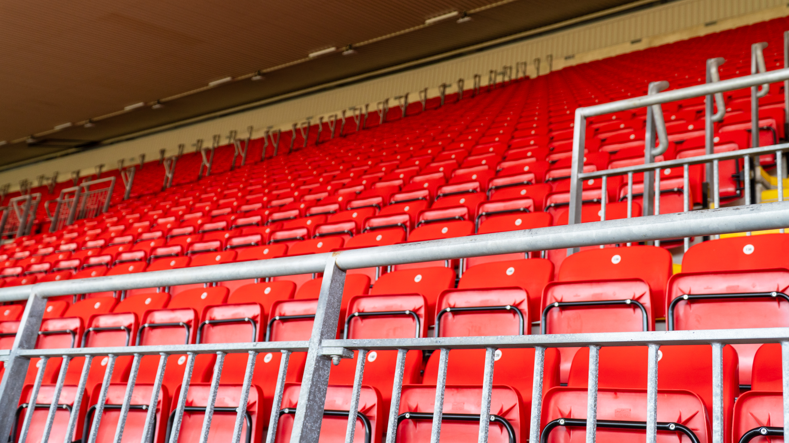

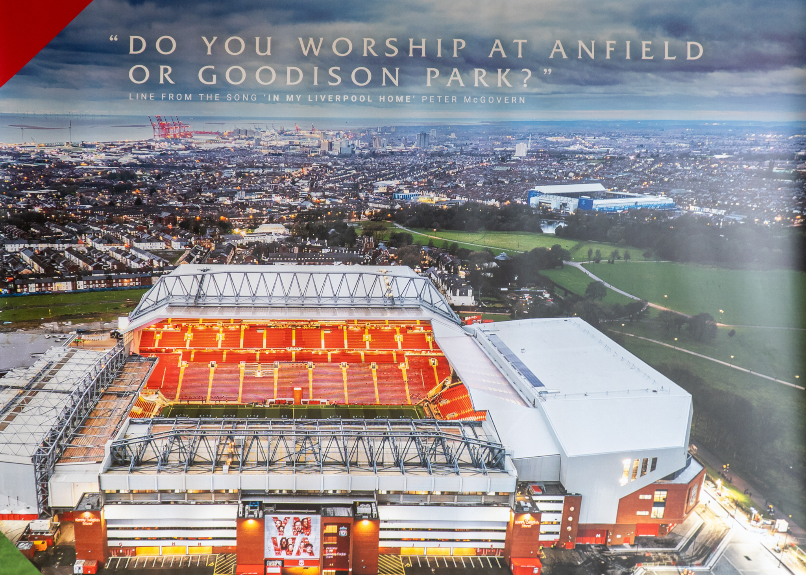

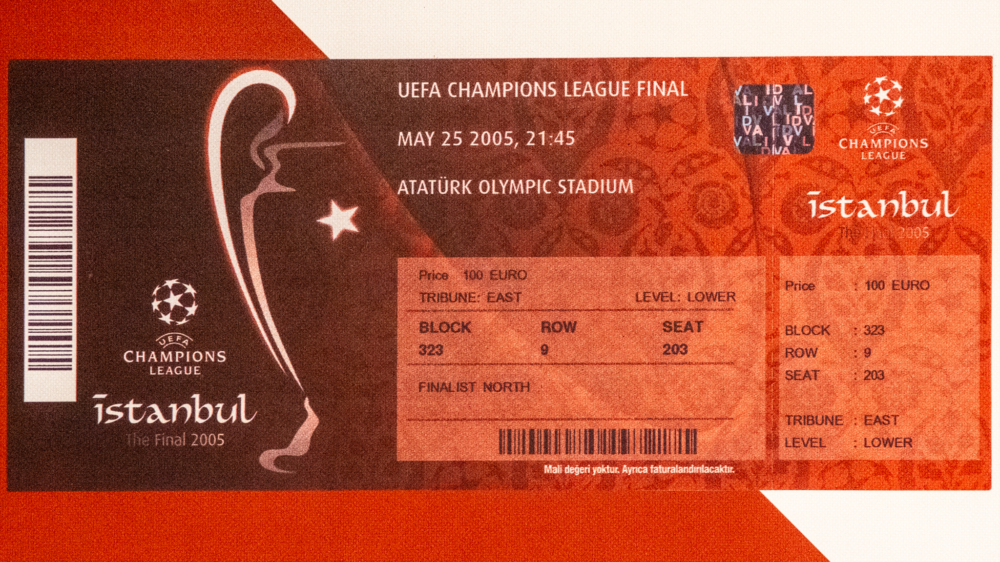

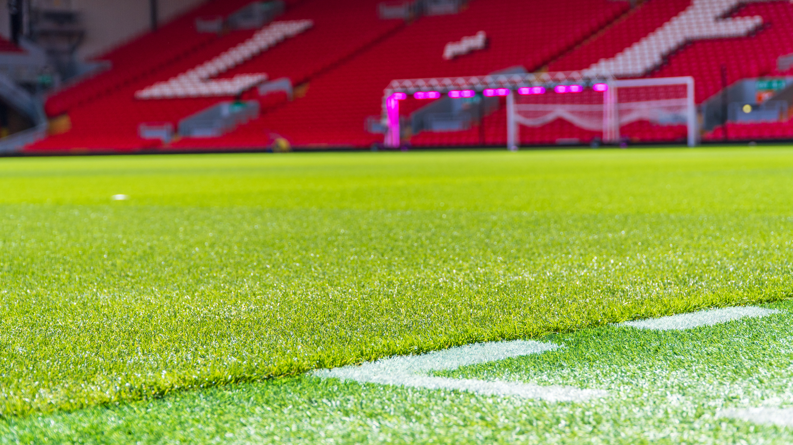

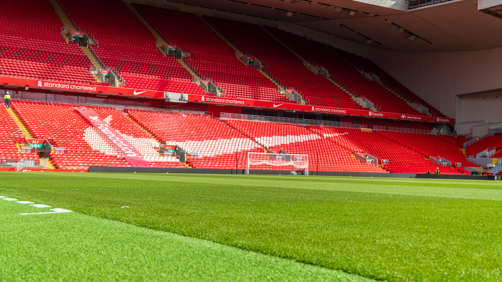

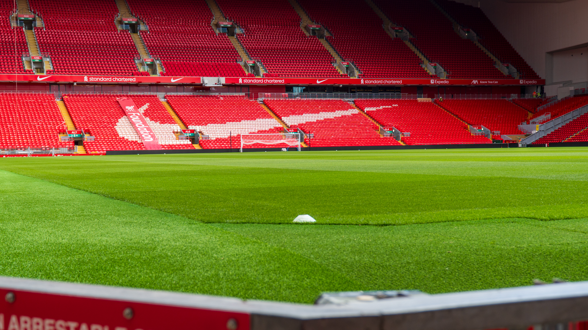

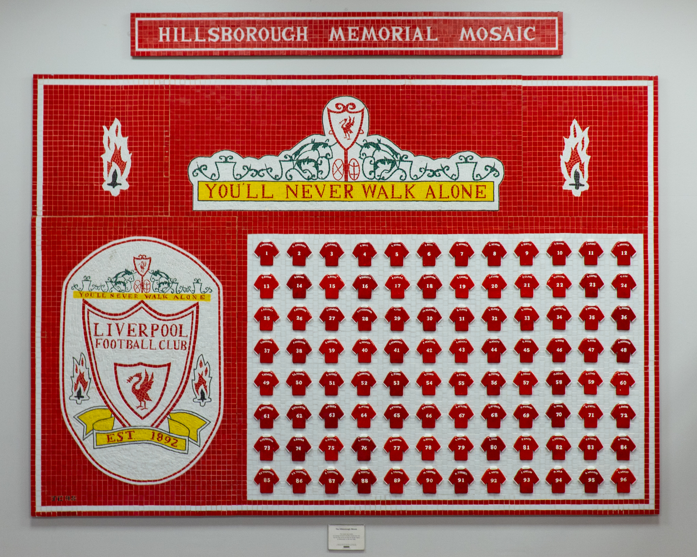

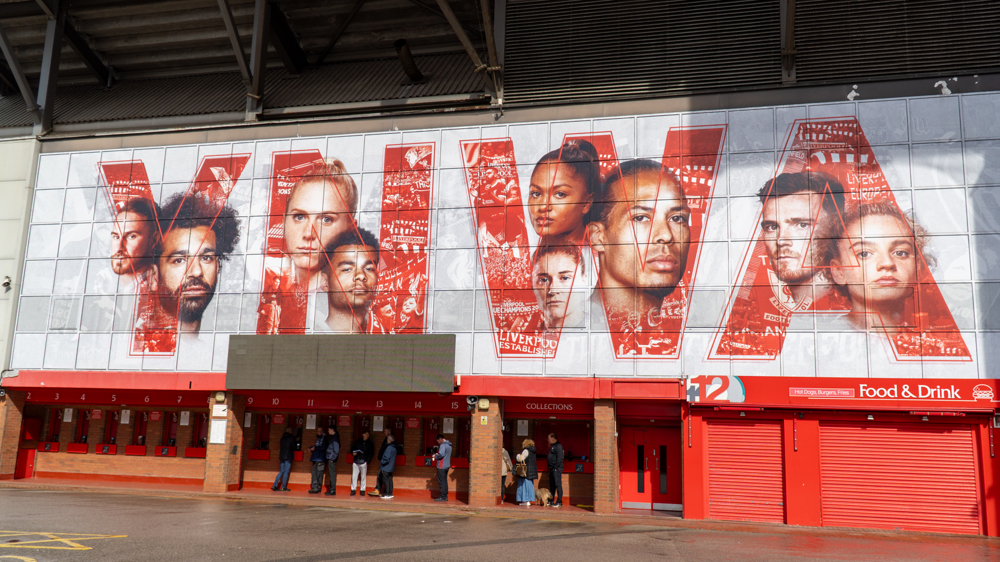

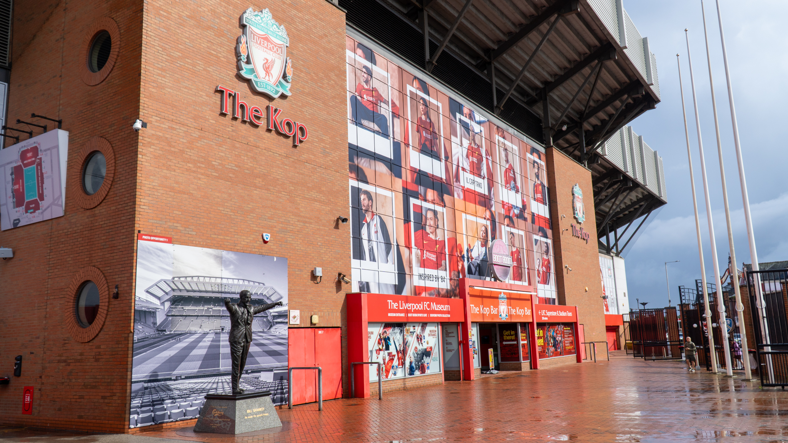

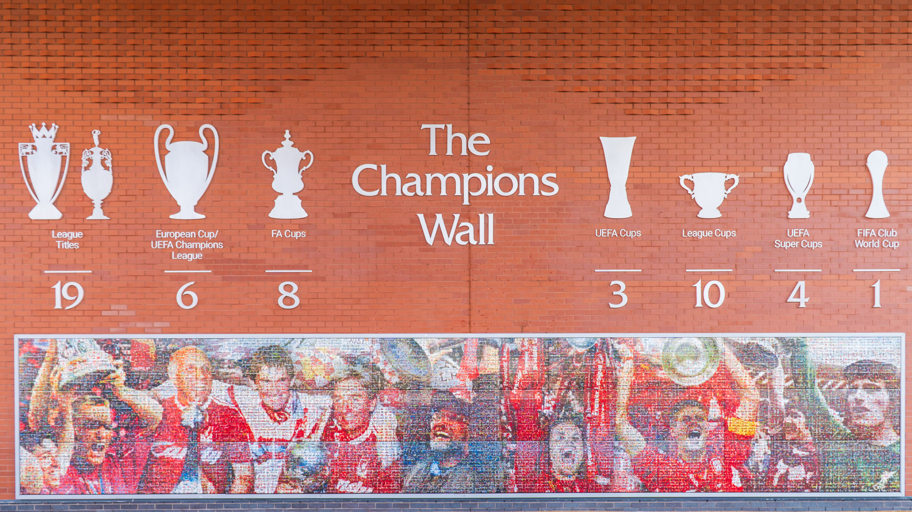
